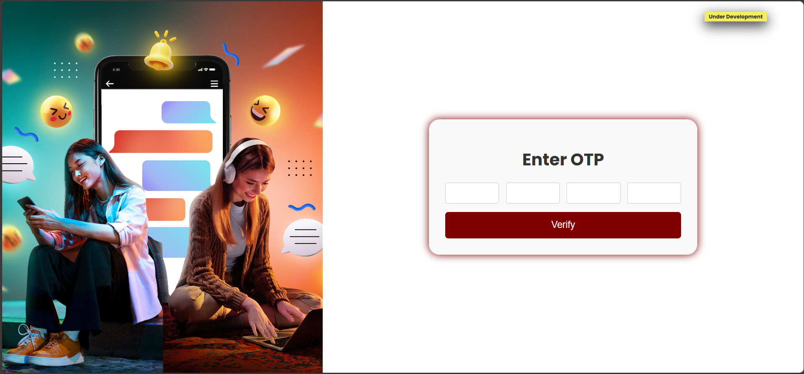

# 💬 Realtime Chat App

## 🚀 Project Description

**Realtime Chat App** is a real-time messaging application built using the MERN stack, featuring Socket.io for seamless communication. This application allows users to engage in instant messaging, creating chat rooms for various topics, and exchanging messages in real-time. The Realtime Chat App is designed to provide a simple and intuitive platform for users to connect and communicate effortlessly.


## ✨ Features

- **Real-time 🚀 Messaging:**
  - Instantly send and receive messages in real-time, creating a dynamic and responsive chatting experience.

- **Chat Rooms 🌐 :**
  - Users can create and join different chat rooms, allowing for organized and topic-specific conversations.

- **User Authentication 🔒 :**
  - Secure user authentication using JSON Web Tokens (JWT) to ensure the privacy and integrity of user data.

- **Responsive Design 📱 :**
  - A responsive and user-friendly interface built with React.js, making the application accessible across various devices.

- **Persistent Data Storage 🗄️ :**
  - MongoDB is used as the database to store chat messages and user information, ensuring data persistence.

- **File Sharing 📎 :**
  - Support for sharing files within the chat, facilitating collaboration and content sharing.

- **Customizable User Profiles 🎨 :**
  - Users can personalize their profiles with avatars, status messages, and other customizable details.

- **Search Functionality 🔍 :**
  - Search through chat history or messages to quickly find specific information.

- **Multimedia Support 🎬 :**
  - Embed images, videos, and other multimedia content directly within the chat.

- **Intuitive User Interface 🎨 :**
  - Design a clean and intuitive user interface for a positive user experience.


## 🚀 Installation

Follow these steps to set up and launch the MERN Chat App on your local machine:
```bash
# 1. Clone the Repository
git clone https://github.com/b-alramlawi/realtime-chat.git

# 2. Navigate to Server Directory
cd mern-chat-app/server

# 3. Install Server Dependencies
npm install

# 4. Create Server Environment Variables
# Create a `.env` file in the `server` directory with the following variables:
# PORT=5000  # or your preferred port number
# MONGO_URI=your_mongo_db_connection_string
# JWT_SECRET=your_secret_key

# 5. Start the Server
npm start

# 6. Open a New Terminal Tab/Window
# Keep the server running, and in a new terminal tab or window, navigate to the client directory:
cd ../client

# 7. Install Client Dependencies
npm install

# 8. Start the Client
npm start
```

## 🚀 Technologies Used

### Server:
- 🚀 [Node.js](https://nodejs.org/): JavaScript runtime for server-side development.
- 🌐 [Express.js](https://expressjs.com/): Web application framework for Node.js, simplifying server-side development.
- 🍃 [MongoDB](https://www.mongodb.com/): NoSQL database for efficient and scalable data storage.
- 📦 [Mongoose](https://mongoosejs.com/): MongoDB object modeling for Node.js, providing a more straightforward data interaction.
- 🔗 [Socket.io](https://socket.io/): Real-time communication library for enabling instant messaging functionality.

### Client:
- ⚛️ [React](https://reactjs.org/): JavaScript library for building user interfaces, making the client-side interactive and dynamic.
- 🌐 [React Router](https://reactrouter.com/): Declarative navigation for React applications, allowing for seamless page transitions.
- 🔗 [Socket.io-client](https://socket.io/docs/v4/client-api/): Client-side library for real-time communication with the server.
- 📡 [Axios](https://axios-http.com/): Promise-based HTTP client for making API requests easily.

## Screenshots/Demo

Here are some screenshots and a brief demo of the MERN Stack Chat App:

<table class="full-width">
  <tr>
    <td align="center">
      <em>Title for Screenshot 1</em>
      <br>
      <br>
      
    </td>
  </tr>
  <tr>
    <td align="center">
      <em>Title for Screenshot 2</em>
      <br>
      <br>
      
    </td>
  </tr>
  <!-- Add more rows as needed -->
</table>


## Learn More

You can learn more in the [Create React App documentation](https://facebook.github.io/create-react-app/docs/getting-started).

To learn React, check out the [React documentation](https://reactjs.org/).

### Code Splitting

This section has moved here: [https://facebook.github.io/create-react-app/docs/code-splitting](https://facebook.github.io/create-react-app/docs/code-splitting)

### Analyzing the Bundle Size

This section has moved here: [https://facebook.github.io/create-react-app/docs/analyzing-the-bundle-size](https://facebook.github.io/create-react-app/docs/analyzing-the-bundle-size)

### Making a Progressive Web App

This section has moved here: [https://facebook.github.io/create-react-app/docs/making-a-progressive-web-app](https://facebook.github.io/create-react-app/docs/making-a-progressive-web-app)

### Advanced Configuration

This section has moved here: [https://facebook.github.io/create-react-app/docs/advanced-configuration](https://facebook.github.io/create-react-app/docs/advanced-configuration)

### Deployment

This section has moved here: [https://facebook.github.io/create-react-app/docs/deployment](https://facebook.github.io/create-react-app/docs/deployment)

### `npm run build` fails to minify

This section has moved here: [https://facebook.github.io/create-react-app/docs/troubleshooting#npm-run-build-fails-to-minify](https://facebook.github.io/create-react-app/docs/troubleshooting#npm-run-build-fails-to-minify)
